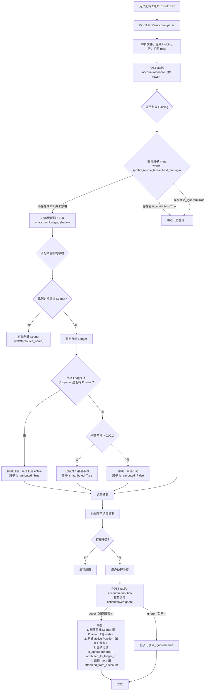

# E账户对账与归因设计（2026-08-16）

> 状态：**已确认**（2026-08-16 讨论定稿，待编码）
> 版本：v1.0（最终编码版）
> 关联：PR #1021（E账户持仓导入后端已合入 main-v2）；前端设计 `./frontend-holding-import-plan-2026-08-16.md`；设计依据 `./e-account-import-data-decentralization-plan-2026-08-16.md`；权威规范 `docs/spec/`。

## 1. 背景与设计原则

### 1.1 背景

PR #1021 已合入 E账户持仓快照导入：解析 → 预览 → 确认 → 落 `e_account` 聚合账户（`upsert_from_holding`，`(ledger_id, symbol)` 业务键，SET 语义整条替换，**不产生交易流水**）。

E账户（中国结算）数据特征（真实样本 2026-08-12 核实，解析器 `COLUMN_MAP` 已含）：基金代码/名称/持有份额/份额日期/基金净值/资产市值/结算币种/**销售机构**/**基金管理人**/份额类别/基金账户/交易账户/分红方式。**包含销售机构与基金管理人双重维度，但不含交易流水与持仓成本。**

本设计在 PR #1021 基础上扩展「**对账与归因**」能力，解决三个核心问题：

1. **快照 SET 与流水推导同 Ledger 互踩**：E账户快照（全量 SET）与渠道流水（增量累积）若写同一 `(ledger_id, symbol)` 会互相覆盖；
2. **E账户重复导入复活已归因持仓**：E账户快照是全量 SET，归因后再次导入会把已归因持仓拉回暂存区；
3. **E账户数据无成本字段**：`avg_price` 缺失时降级为净值近似，盈亏/XIRR 失真。

### 1.2 核心设计原则

1. **Ledger 是用户心智容器**：天天基金、支付宝等销售平台即 `Ledger`，不做物理层（TA 系统）的强行映射；Ledger 是用户容器层，不是物理审计台账。
2. **快照与流水共存不互踩**：通过 `ownership_status`（active/shadow）和 `is_attributed` 标记实现物理隔离。
3. **自动归因，保守覆盖**：空位自动填入，冲突留待用户决策，成本缺失显式提示。
4. **防复活机制**：已归因/已忽略的记录在后续导入中自动跳过，避免重复覆盖。

## 2. 核心决策矩阵（2026-08-16 讨论定稿）

| 争议点 | 最终决策 |
| :--- | :--- |
| **Ledger 语义** | 销售平台/交易入口（天天基金、支付宝、直销），**用户心智第一** |
| **Position 合并规则** | 同 Ledger 同 symbol 合并；**跨 Ledger 绝不合并**（即使同基金，各自成本基础、各自平台卖出） |
| **物理溯源** | `position_import_meta`（fund_manager / fund_account / trade_account），不新增 Position 溯源字段 |
| **E账户 vs 流水互踩** | **融合方案**：渠道 Ledger 无该 symbol 持仓 → 自动归因；有且份额一致 → 已核对静默跳过；有且份额不一致 → 冲突落暂存区，覆盖权交用户 |
| **归因持久性** | `is_attributed=True` 防复活：已归因记录后续 E账户导入自动跳过（不覆盖、不重建冲突） |
| **渠道视图** | **不需要**——渠道 = Ledger，天然 `WHERE ledger_id = X` |
| **E账户视图** | 对账中心查询 `e_account` Ledger 下的影子记录（`ownership_status='shadow'`）；跨渠道聚合展示由前端按 `fund_manager` 分组 |
| **存量迁移** | **零迁移**——现有「天天基金」等 Ledger 语义正确，保留不动 |
| **Transaction** | 保持 `position_id=None`（孤立流水，不改架构），仅用于 XIRR 与历史明细追溯；持仓聚合以 Position 为准 |
| **API 模式** | **无状态**：parse 返回 rows（前端持有）→ reconcile 传 rows 落库，与现有 parse/confirm 模式一致，不引入 job 缓存 |

## 3. 数据模型变更（DDL）

### 3.1 `positions` 表新增列

```sql
ALTER TABLE positions ADD COLUMN ownership_status VARCHAR(20) DEFAULT 'active';
-- 枚举值: 'active'（参与总资产）, 'shadow'（仅对账，不参与总资产）
```

**总资产计算只包含 `ownership_status='active'`**。暂存区未归因记录 = `shadow`（防与渠道流水推导持仓重复虚增）。

### 3.2 `position_import_meta` 表变更（核心）

`(symbol, source_broker, fund_manager)` 是 E账户记录的**自然主键**，放 JSON 会导致对账/导入高频查询全表扫描，抽成独立列：

```sql
ALTER TABLE position_import_meta ADD COLUMN source_broker VARCHAR(200);
ALTER TABLE position_import_meta ADD COLUMN fund_manager VARCHAR(200);
ALTER TABLE position_import_meta ADD COLUMN is_attributed BOOLEAN DEFAULT FALSE;
ALTER TABLE position_import_meta ADD COLUMN is_ignored BOOLEAN DEFAULT FALSE;
ALTER TABLE position_import_meta ADD COLUMN attributed_at TIMESTAMP;
ALTER TABLE position_import_meta ADD COLUMN attributed_to_ledger_id INTEGER REFERENCES ledgers(id);
ALTER TABLE position_import_meta ADD COLUMN import_error BOOLEAN DEFAULT FALSE;  -- 标记导入失败的行

-- 唯一索引：仅约束影子记录（source_broker/fund_manager 非空即影子记录）
-- 渠道 meta 的这两列必须为 NULL（不触发唯一约束，PostgreSQL 多个 NULL 不违反唯一）
CREATE UNIQUE INDEX idx_import_meta_unique ON position_import_meta (symbol, source_broker, fund_manager)
WHERE source_broker IS NOT NULL AND fund_manager IS NOT NULL;

-- 查询索引
CREATE INDEX idx_import_meta_attributed ON position_import_meta (is_attributed);
CREATE INDEX idx_import_meta_ignored ON position_import_meta (is_ignored);
```

**列语义**：

| 列 | 说明 |
| :--- | :--- |
| `source_broker` / `fund_manager` | E账户记录自然主键；**仅影子记录填充，渠道 meta 必须为 NULL**（防唯一索引冲突） |
| `is_attributed` | 防复活标记：已归因/已核对记录 E账户导入跳过；**只标记影子记录** |
| `is_ignored` | 用户忽略标记：导入跳过，可手动重置 |
| `attributed_at` / `attributed_to_ledger_id` | 归因追溯（时间戳 + 目标 Ledger） |
| `import_error` | 导入失败行标记（无净值/无成本且无净值时） |

**迁移策略**：新增列可空 → 存量从 `raw_extra` 回填 → 回填完成后设 `NOT NULL`（`source_broker`/`fund_manager` 除外，渠道 meta 恒为 NULL）。

### 3.3 `sales_broker_mappings` 表（销售机构映射）

```sql
CREATE TABLE sales_broker_mappings (
    id SERIAL PRIMARY KEY,
    source_name VARCHAR(200) UNIQUE NOT NULL, -- E账户原始名称（销售机构字段）
    display_name VARCHAR(100) NOT NULL,        -- 用户友好名称
    user_override BOOLEAN DEFAULT FALSE,       -- 用户是否自定义覆盖
    created_at TIMESTAMP DEFAULT CURRENT_TIMESTAMP
);

-- 系统内置映射初始化（只处理销售机构字段，基金管理人不参与映射）
INSERT INTO sales_broker_mappings (source_name, display_name, user_override) VALUES
('蚂蚁（杭州）基金销售有限公司', '支付宝', FALSE),
('上海天天基金销售有限公司', '天天基金', FALSE),
('招商银行股份有限公司', '招商银行', FALSE),
('易方达基金管理有限公司', '易方达直销', FALSE);  -- 直销场景：基金公司官网即销售机构
-- （注：根据 AMAC 清单补充其余机构）
```

- 自动创建 Ledger 时优先用映射名，无映射用原始 `source_broker` 名；
- 用户在账户设置页可修改任何 Ledger 名称（`user_override=True`），系统不覆盖用户自定义。

### 3.4 影子记录规则（硬伤 2 修正）

**E账户导入的每一条记录，无论最终走向哪个分支，都必须先在 `e_account` Ledger 下创建/更新一条 `ownership_status='shadow'` 的影子 Position（含 meta，记 symbol+source_broker+fund_manager）。**

| 场景 | 渠道 Position（active） | 影子记录（shadow，e_account Ledger） |
| :--- | :--- | :--- |
| 渠道无该 symbol 持仓 → 自动归因 | **新建** active（E账户数据） | **新建/更新** shadow + `is_attributed=True` |
| 渠道有持仓且份额一致 → 已核对 | **不动**（保持原有） | **新建/更新** shadow + `is_attributed=True`（防复活） |
| 渠道有持仓且份额不一致 → 冲突 | **不动**（保持原有） | **新建/更新** shadow + `is_attributed=False`（等待用户决策） |

对账中心永远查询 `e_account` Ledger 下的所有影子记录（含已归因和未归因），**E账户侧数据永不缺失**。

## 4. 核心流程逻辑

### 4.1 导入与对账流程（全链路）



### 4.2 冲突判定逻辑（只看份额）

```python
def is_conflict(existing_pos, eaccount_record):
    """冲突判定：仅当份额差异 > 0.001 份时判定为冲突。
    成本差异仅用于展示，不做判定——E账户成本是净值近似，与真实成本必然有差异，
    成本维度判定会让所有有持仓的 symbol 判为冲突（假冲突）。"""
    share_diff = abs(existing_pos.quantity - eaccount_record.quantity)
    return share_diff > 0.001
```

### 4.3 归因覆盖事务边界

```python
def execute_attribution_cover(record_id, target_ledger_id, avg_price=None, family_id=1):
    """归因覆盖操作（事务原子性）"""
    with db.transaction():
        # 1. 查找影子记录（e_account Ledger, shadow）
        shadow_pos = get_position(record_id, family_id=family_id)
        # 2. 删除目标 Ledger 下同 symbol 的旧 Position（含其 import_meta）
        old_pos = get_position_by_ledger_and_symbol(target_ledger_id, shadow_pos.symbol, family_id)
        if old_pos:
            delete_position(old_pos.id)  # 级联删除其 import_meta
        # 3. 新建 active Position（挂目标 Ledger）
        new_pos = create_position(
            ledger_id=target_ledger_id,
            symbol=shadow_pos.symbol,
            quantity=shadow_pos.quantity,
            avg_price=avg_price or shadow_pos.avg_price or approximate_by_nav(),  # 成本缺失用净值近似
            ownership_status='active',
            family_id=family_id,
        )
        # 4. 影子记录标记归因（防复活 + 追溯）
        shadow_pos.ownership_status = 'shadow'  # 确保不参与总资产
        shadow_pos.ledger_id = 'e_account'      # 保留在暂存区
        update_import_meta(
            position_id=shadow_pos.id,
            is_attributed=True,
            attributed_at=now(),
            attributed_to_ledger_id=target_ledger_id,
        )
        # 5. 渠道新 Position 的 meta：source_broker/fund_manager 必须为 NULL（防唯一索引冲突）
        create_import_meta(
            position_id=new_pos.id,
            source_broker=None,
            fund_manager=None,
            is_attributed=False,
            raw_extra={'attributed_from_eaccount': True, 'attributed_at': now().isoformat()},
        )
```

## 5. API 设计（无状态）

### 5.1 `POST /api/e-account/parse`（解析）

- **请求**：`multipart/form-data`，字段 `file`（复用现有 `POST /api/importers/holdings/parse` 逻辑，`source=e_account_holding`）
- **响应**：`{data: {rows: [...], total, error_count, duplicate_count}, message}`——rows 由前端持有，后续 reconcile 传回

### 5.2 `POST /api/e-account/reconcile`（对账并落库）

- **请求**：`{rows: [解析行[]]}`（无状态，直接传 rows）
- **响应**（摘要）：

```json
{ "data": {
    "auto_attributed": 10,   // 自动归因至渠道，active
    "verified": 2,           // 核对一致，无操作
    "conflicts": 3,          // 待处理，暂存区 shadow
    "ignored_skipped": 1,    // is_ignored=True 跳过
    "attributed_skipped": 2, // is_attributed=True 跳过（防复活）
    "failed_rows": [ { "line": 3, "symbol": "014330", "reason": "无净值数据" } ],
    "conflict_list": [
      { "record_id": 123, "symbol": "014330", "name": "易方达蓝筹",
        "source_broker": "蚂蚁（杭州）基金销售有限公司", "fund_manager": "易方达基金管理有限公司",
        "target_ledger_id": 5, "target_ledger_name": "支付宝",
        "current_quantity": 500, "current_cost": 1000,
        "eaccount_quantity": 1000, "eaccount_cost": null,
        "diff_quantity": 500 }
    ]
  }, "message": "对账完成" }
```

### 5.3 `POST /api/e-account/attribution`（处理冲突，**幂等**）

- **请求**：

```json
{ "decisions": [
    { "record_id": 123, "action": "cover", "target_ledger_id": 5, "avg_price": 1.85 },
    { "record_id": 124, "action": "ignore" }
] }
```

- **响应**：`{data: {success: 2, failed: 0, details: [{record_id, status: "covered", new_position_id: 456}]}, message}`
- **幂等**：重复归因/忽略返回当前状态（HTTP 200），不报错、不重复执行

### 5.4 `GET /api/e-account/reconciliation`（对账中心）

- **请求参数**：`status`（all | pending | attributed | ignored | verified，默认 all）
- **响应**：

```json
{ "data": {
    "data_date": "2026-08-15",   // 影子记录 max(updated_at)，标注数据新鲜度
    "items": [
      { "record_id": 123, "symbol": "014330", "name": "易方达蓝筹",
        "source_broker": "蚂蚁（杭州）基金销售有限公司", "fund_manager": "易方达基金管理有限公司",
        "eaccount_quantity": 1000, "system_quantity": 500, "diff": 500,
        "status": "pending",           // pending | attributed | ignored | verified
        "attributed_to": null,         // 已归因时显示渠道名
        "is_ignored": false }
    ],
    "summary": { "pending_count": 2, "attributed_count": 10, "ignored_count": 1, "verified_count": 3 }
  }, "message": "ok" }
```

**`status` 推导规则（P1 锁定）**：

| 条件 | status |
| :--- | :--- |
| `is_attributed=True` + `attributed_to_ledger_id IS NOT NULL` | `attributed`（用户/自动归因） |
| `is_attributed=True` + `attributed_to_ledger_id IS NULL` | `verified`（自动核对一致） |
| `is_ignored=True` | `ignored` |
| 其余（`is_attributed=False` + `is_ignored=False`） | `pending`（未归因冲突） |

**已归因记录参与差异提示（只提示不覆盖）**：`status='attributed'` 的记录必须返回且携带 `diff`；前端显示「已归因至 [渠道名]」，差异数字显示但操作按钮禁用。

## 6. 关键状态字段速查表

| 字段 | 适用对象 | 含义 | 参与总资产? | 防复活? |
| :--- | :--- | :--- | :--- | :--- |
| `ownership_status='active'` | 渠道 Ledger | 正常持仓 | ✅ 是 | N/A |
| `ownership_status='shadow'` | e_account Ledger | 暂存区/影子记录 | ❌ 否 | N/A |
| `is_attributed=True` | 影子 meta | 已归因/已核对 | ❌ 否 | ✅ 是（导入自动跳过） |
| `is_ignored=True` | 影子 meta | 用户选择忽略 | ❌ 否 | ✅ 是（导入自动跳过） |
| `is_attributed=False` + `shadow` | 影子 meta | 未归因冲突记录 | ❌ 否 | ❌ 否（每次导入触发冲突） |

**影子记录生命周期（P6 锁定）**：**永不删除**。用户清仓后（渠道 Position 删除），影子记录仍在，对账中心显示「E账户有 X，系统无」——这是**预期行为**（清仓差异提示是特性，非 bug）。

## 7. 错误处理与边缘场景

1. **批量导入逐条事务**：单条记录失败（如数据库异常）→ 回滚该条，记录错误并继续下一条；返回结果含失败明细（`failed_rows`）。
2. **无净值/无成本**：无 `avg_price` → 优先用 `current_price`（净值）近似；两者都缺失或为 0 → **该行报错跳过**（`upsert_from_holding` 校验价格必须 > 0，`avg_price=0` 会 ValueError），影子记录标记 `import_error=True`，摘要 `failed_rows` 列出原因。
3. **映射表缺失**：`source_broker` 不在映射表 → 自动创建名为原始名称的 Ledger，摘要提示「已自动创建新账户：[名称]」。
4. **归因目标 Ledger 不存在**：返回 `400 Bad Request`，提示「目标账户不存在，请重新选择」。
5. **attribution 幂等**：重复归因/忽略返回当前状态（HTTP 200），不报错、不重复执行。
6. **并发**：E账户导入与归因操作互斥（同一 family 加锁或串行化），防止竞态。

## 8. 语义细节锁定（P1-P6）

| 编号 | 细节点 | 最终决策 |
| :--- | :--- | :--- |
| **P1** | 已核对 vs 已归因区分 | `is_attributed=True` + `attributed_to_ledger_id IS NOT NULL` → `attributed`；`is_attributed=True` + `attributed_to_ledger_id IS NULL` → `verified` |
| **P2** | 防复活 vs 数据新鲜度 | 对账中心顶部显示 `data_date`（影子记录 max(updated_at)），标注「E账户数据为最近一次导入 [日期]，如需更新请重新导入」 |
| **P3** | 归因覆盖后流水增量成本误差 | 归因成本是净值近似，后续流水增量（`process_buy_or_deposit` 在归因 Position 上增量）继承近似误差；归因覆盖完成时 UI 提示「E账户成本为净值近似，建议手动补充真实成本」 |
| **P4** | attribution 幂等性 | 重复归因/忽略幂等：第二次调用返回当前状态（HTTP 200），不报错、不重复执行 |
| **P5** | family_id 多用户隔离 | **所有查询/写入**（影子记录、渠道 Position、meta）必须带 `family_id`，与 `upsert_from_holding` 现有行为一致 |
| **P6** | 影子记录生命周期 | **永久保留**；清仓后渠道 Position 删除、影子记录仍在，对账中心显示「E账户有 X，系统无」——预期行为（特性非 bug） |

## 9. 与现有代码衔接

| 现有代码 | 变更 |
| :--- | :--- |
| `commit_holdings`（`POST /api/importers/holdings/confirm`） | **接口契约冻结**（请求/响应格式不变），内部逻辑增加 `is_attributed`/`is_ignored` 过滤（防旧调用方复活已归因记录） |
| `upsert_from_holding` | 合并键 `(ledger_id, symbol)` 不变；新增 `ownership_status` 支持（active/shadow） |
| E账户解析器 `e_account_holding.py` | **不改**——`COLUMN_MAP` 已含销售机构/基金管理人/基金账户/交易账户/分红方式 |
| `get_or_create_e_account_ledger` | 保留（暂存区 Ledger 仍需要） |

## 10. PR #1021 返工范围

PR #1021 已合入的 E账户导入代码需要返工，范围如下：

| 原代码 | 原行为 | 新行为 |
| :--- | :--- | :--- |
| `commit_holdings`（`POST /api/importers/holdings/confirm`） | E账户快照全量 SET 到 `e_account` 聚合账户 | **接口契约冻结**（请求/响应格式不变），内部仅增加 `is_attributed`/`is_ignored` 过滤（防旧调用方复活已归因记录）；**不承担**自动归因/冲突检测——新流程落库入口是 `reconcile`（§5.2） |
| `get_or_create_e_account_ledger` | 创建/复用 `e_account` 聚合账户（`ledger_type='e_account'`，orchestrator.py:734） | **保留**，作为影子记录的暂存区 Ledger |
| `upsert_from_holding` | `(ledger_id, symbol)` 业务键，SET 语义 | **新增** `ownership_status` 支持；调用方显式传 `'active'` 或 `'shadow'` |

**关键差异**：

- 旧行为：E账户导入 = 全量覆盖 `e_account` 聚合账户；
- 新行为：E账户导入 = `reconcile` 逐条处理（先建影子记录 → 匹配渠道 → 自动归因/冲突/已核对），影子记录永久保留，渠道 Position 按分支落库。

## 11. 变更记录

- 2026-08-16：创建（讨论定稿 v1.0，待编码）。
- 2026-08-16：v1.1 补充 PR #1021 返工范围（§10）；修正「E账户视图」措辞（对账中心查影子记录，跨渠道聚合由前端按 fund_manager 分组）。
- 2026-08-16：v1.1.1 实施前代码核验，发现 §3.4/§4.1 影子记录方案与现有 DB 约束冲突，经用户确认修正（见 §12）。
- 2026-08-17：v1.1.2 实施后审查修正（见 §13）：对账中心 diff 语义、ignore 事务性、无价格行 import_error、交割单导入 4 处 bug。

## 13. v1.1.2 实施后审查修正（2026-08-17，用户已确认）

**本节修正优先于前文冲突处。** 编码完成后的代码审查发现以下实现偏差/bug，已修复并补测试。

### 13.1 E账户对账修正

| 项 | 问题 | 修正 |
| :--- | :--- | :--- |
| E1 | `attribute_holdings` 的 ignore 分支只 flush 不 commit；后续 cover 失败 rollback 会把 ignore 标记一起回滚 | ignore 分支改为单条事务（立即 commit，失败 rollback + 计 failed） |
| E2 | `get_reconciliation` 的 diff 用单条影子记录份额对比 symbol 级系统汇总——多渠道场景（E账户 1000+500 份 vs 系统 1500 份）每条 diff 恒为偏差，误导用户 | diff 改为 **symbol 级汇总对比**：`diff = eaccount_total - system_total`；每条记录保留自身 `eaccount_quantity`，新增 `eaccount_total` 字段 |
| E3 | `_parse_snapshot_date` 只接受字符串，date/datetime 对象输入抛 TypeError 降级为今天（数据错误） | 先判 `datetime`/`date` 对象直接取 date，字符串才 strptime |
| E4 | 无净值/无成本行直接抛错进 failed_rows，不落影子记录（「E账户侧数据永不缺失」不成立）；`import_error` 列从未置位 | 无价格行**照常落影子记录**（`avg_price=0` 占位——列不可空）+ `meta.import_error=True`，计入 failed_rows 提示但不中断渠道匹配 |
| E5 | `_upsert_shadow_holding` 返回 Position，reconcile 里重复查 meta | 返回 `(position, meta)` 二元组，删重复查询 |
| E6 | `reconcile_holdings` 单条异常不 rollback，部分写入随最终 commit 提交 | 单行处理包进 `begin_nested()` savepoint，失败回滚该行中间写入 |

### 13.2 交割单导入修正（既有代码，用户授权一并修）

| 项 | 问题 | 修正 |
| :--- | :--- | :--- |
| B1 | `commit` SPLIT（转股）分支 `price` 传元未转分（`Transaction.price` 列是分，BOND_REDEEM 分支已转） | `price=Money.yuan_to_cents(...)` |
| B2 | `commit_from_preview` 构造记录时丢 `net_amount`（THS 场景关键字段，丢失后降级用 amount） | 补传 `net_amount=row.get('net_amount') or 0` |
| B3 | `commit` 单条非 SQLAlchemyError 异常不 rollback，部分写入随最终 commit 提交 | **本轮不修**（影响现有导入行为，风险大），代码加 TODO 标记，后期统一 savepoint |
| B4 | cash 分支缺 ledger_id 时 continue 不计数，统计失真 | `skipped += 1` |
| B5 | `Decimal(str(row.get('amount', 0)))` 遇 None 崩溃 | `Decimal(str(row.get(x) or 0))`（amount/quantity/price/fee） |

### 13.3 标记后期（未修）

- `_fill_missing_nav_and_shares` 份额计算 `quantize('0.00')` 只保留 2 位小数，与 min_unit（份×10000）精度不一致——设计权衡；
- `_match_fund_by_name` 相似度算法粗糙（长度差）——既有行为；
- `commit_holdings` 与 `reconcile_holdings` 职责重叠（旧路径保留）——设计决策已固化。

## 12. v1.1.1 实施前核验修正（2026-08-16，用户已确认）

**本节修正优先于前文冲突处。**

### 12.1 发现的问题（根因证据）

E账户记录粒度是「基金 + 销售机构」——同一基金经不同销售机构购买（多渠道）是常见场景。而现有模型有三处约束与 §3.4「影子记录挂 e_account Ledger」方案冲突：

1. `positions` 表唯一约束 `uq_positions_ledger_symbol`（`ledger_id + symbol` 唯一，positions/models.py）→ 同 symbol 多渠道的两条影子记录在同一 Ledger 下必冲突；
2. `position_import_meta.import_hash` 唯一 + `compute_position_hash`（importer/records.py）维度为 `source|ledger_id|symbol|snapshot_date`，不含 source_broker → 多渠道同 symbol 同日期 hash 相同；
3. 通用 `upsert_from_holding`（position_service.py）按 `(symbol, ledger_id, family_id)` 匹配 → 多渠道第二条记录命中 existing 被覆盖合并，渠道维度丢失。

**推论**：现有已上线的 e_account_holding 导入本身即存在多渠道数据丢失（同基金多渠道被合并为一条、后者覆盖前者）。本次修正一并修复。

### 12.2 修正方案（最小偏差）

| 项 | §3.4/§4.1 原方案 | v1.1.1 修正 |
| :--- | :--- | :--- |
| 影子记录宿主 | e_account Ledger 下 | **`ledger_id = NULL`**（不挂任何 Ledger；纯对账数据不参与总资产；SQLite UNIQUE 对 NULL 宽松，多渠道可共存） |
| 影子记录匹配键 | 复用通用 upsert | **专用 upsert：按 `(symbol, source_broker, fund_manager)` 匹配**，不复用 `upsert_from_holding` 的 `(ledger_id, symbol)` 匹配 |
| 影子记录 import_hash | 现有函数 | **扩展 `compute_position_hash` 加可选 `source_broker` 参数**（仅影子记录传，其余调用不变，哈希格式向后兼容） |
| 对账/查询 | 查 e_account Ledger 下 shadow | **按 `ownership_status='shadow'` 查询**（对账中心/防复活检查均如此），不再依赖 e_account Ledger |
| e_account Ledger | 需创建（`get_or_create_e_account_ledger`） | **不再为影子记录创建**；`get_or_create_e_account_ledger` 仅保留给 2.0 旧导入路径的暂存用途（§10 返工后同步弃用） |

### 12.3 修正后的实现约束

- 影子记录：`positions.ledger_id = NULL`、`ownership_status = 'shadow'`、meta 填 `source_broker/fund_manager/symbol`（自然主键三元组）；渠道 Position meta 的两列仍必须为 NULL（§3.2 不变）；
- 影子记录 upsert 语义：命中 `(symbol, source_broker, fund_manager)` 更新份额/市值/快照日，未命中新建；同一渠道同一 symbol 同日期的记录仍走去重（hash 含渠道维度后自然幂等）；
- 归因覆盖（cover）：删除目标 Ledger 旧 Position（含 meta）→ 新建 active Position → 影子记录 `is_attributed=True` + `attributed_at` + `attributed_to_ledger_id`，渠道 meta 记 `attributed_from_eaccount`（§4.3 不变）；
- 总资产计算：`ownership_status='active'` 过滤后，`ledger_id` 关联不变（NULL 影子记录天然不参与）。

### 12.4 附带收益

- 修复现有 e_account_holding 导入多渠道数据丢失的预存 bug（同一基金多渠道各自成记录）；
- 影子记录与渠道 Position 彻底解耦（渠道删改不影响 E账户侧数据），「E账户侧数据永不缺失」约束天然成立。
